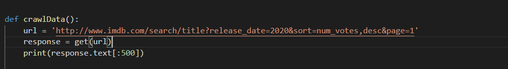

# Crawling me Beautifulsoup
Detyra e tretë nga Lënda “Siguria në Internet”. Grupi i 20

# Rreth këtij aplikacioni

Cka është crawling?
Crawling është marrja automatike e të dhënave duke përdorur ndonjë software ose ndonjë aplikacion. Në rastin tonë ne kemi pasur të ndërtojmë një aplikacion i cili i merr të dhënat nga ndonjë web-faqe (në rastin tonë IMDB), edhe me i nxjerr të dhënat prej asaj web-faqe dhe i ruan ato të dhënat në një spreadsheet.
# Kërkesat

Që ky aplikacion të punojë duheni t’i instaloni këto libraritë duke përdorur [pip](https://pip.pypa.io/en/stable/) package installer

```bash
from tkinter import *
from requests import get
from bs4 import BeautifulSoup
import pandas as pd
from time import sleep
from random import randint
import matplotlib.pyplot as plt
```

# Startimi i aplikacionit

Për me e startu aplikacionin veq hyni te [DataScraping - tkinter] edhe ekzekutoni kodin. Nëse keni të instaluar [Visual Studio Code]( https://code.visualstudio.com/) veq shtypni butonin [F5]

 

# Spjegimi i kodit

*	Definimi i funksionit crawlData()
*	Caktimi i URL prej të cilit do të merret data
*	get(url) – kërko nga serveri përmbajtjen e web faqes edhe ruaj përgjigjen e serverit në *response*



*	find_all() – metoda për ekstraktimin e të gjitha *div* kontenjerat të cilat e kanë atributin e klasës **’lister-item mode-advanced’**
*	Deklarojmë disa *lista* për me i ruajt të dhënat në diku


*	Krijimi i Loop-ave 
*	headers – parametri me anë të cilit nëse nuk dojmë që të dhënat të cilat i marrim të jenë në ndonjë gjuhë tjetër (nëse i marrim të dhënat prej kosovës, disa të dhënat do të përkthehen në gjuhën shqipe)


*  Ekstraktimi i të dhënave


*	Mbikqyrja e të dhënave të ekstraktuara me anë të librarisë Panda
*	Pastrimi i të dhënave
*	Vendosja e të dhënave në spreadsheet


*	Krijimi i grafit me anë të librarisë matplotlib.pyplot


*	Dukja e aplikacionit me anë të librarisë tkinter


# Rezultatet

**Fillimi i ekzekutimit**


**Fundi i ekzekutimit**


**Rezultati në Excel:**


**Rezultati nga Chart-i:**


**Printojmë disa informacione në DataFrame me anë të librarisë Panda:**


# Konkludimi
Si konkludim ne kemi arritur me sukses të marrim rreth 2862 filma me emrat e tyre, imdb-rating të tyre, vitin kur kanë dalë, etj. një web-faqe(IMDB), t’i paraqesim të dhënat në një graf, si dhe t’i paraqesim të gjitha të dhënat e marrura nga web-faqja në një Excel spreadsheet. Si dhe kemi mësuar qysh përdoren libraritë si: tkinter. Panda, matplotlib dhe BeautifulSoup.

# Referencat

* https://www.youtube.com/watch?v=YXPyB4XeYLA&ab_channel=freeCodeCamp.org
* https://www.youtube.com/watch?v=ng2o98k983k&ab_channel=CoreySchafer
* https://matplotlib.org/3.2.1/tutorials/introductory/sample_plots.html
* https://www.python-course.eu/python_tkinter.php
